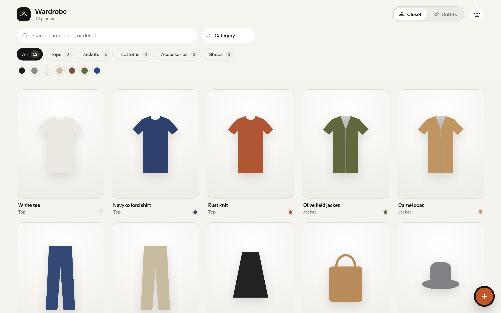
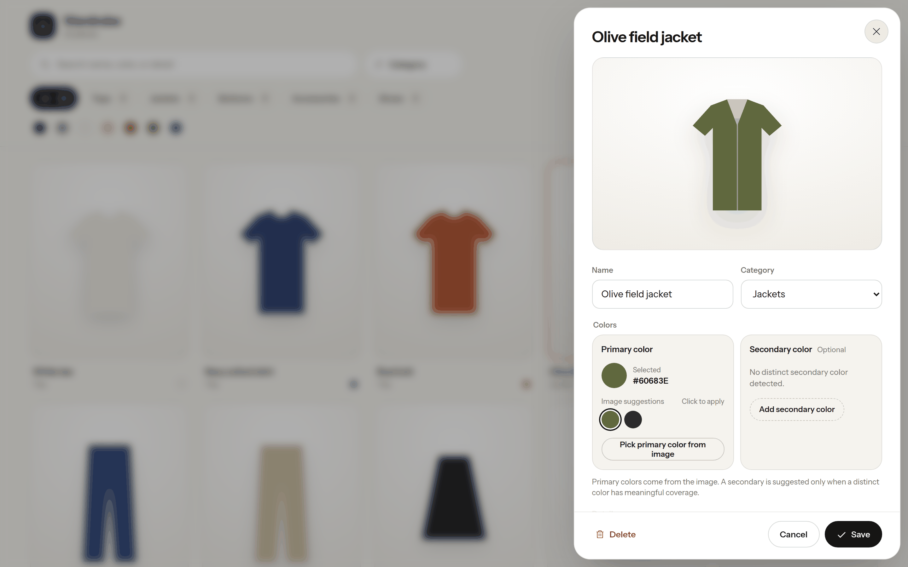

<div align="center">

# Wardrobe

Your clothes, found, cut out and styled with Claude.

[](LICENSE)
[](package.json)

Based on [tandpfun/wardrobe](https://github.com/tandpfun/wardrobe). [See the original post →](https://x.com/cdngdev/status/2076812846793650485)

</div>





## Quick start

```bash
git clone https://github.com/njarrar/wardrobe-najeeb.git
cd wardrobe-najeeb
npm install
cp .env.example .env
npm run dev
```

To run the built app instead of the dev server:

```bash
npm run build
npm start          # http://localhost:4173
```

⚠️ The importer stays disabled until you add `ANTHROPIC_API_KEY` to `.env`. Get a key at [console.anthropic.com](https://console.anthropic.com/settings/keys).

On your computer, garments are cut out of their background by a small open model ([BiRefNet lite](https://huggingface.co/onnx-community/BiRefNet_lite)) through `@huggingface/transformers`. `npm install` adds it when it can; the model downloads (about 200 MB) the first time you import. If it is missing, the app lets you keep the crop with its background.

Open [localhost:5173](http://localhost:5173).

### Use it from your phone

The server only listens on this computer by default. To reach it from another device on your network, set both of these in `.env`:

```bash
WARDROBE_HOST=0.0.0.0
WARDROBE_TOKEN=pick-a-long-random-string
```

The server refuses to listen on your network without a token. Browsers and the app ask for the token once and remember it.

## Run it on Cloudflare

Instead of keeping everything on your computer, you can run Wardrobe on Cloudflare. Photos and images go in R2, your closet and outfits go in D1, and garment cutouts run from a Queue. The app, the iPhone app and phone browsers all talk to the same Worker, so your closet is the same everywhere.

You need:

- A Cloudflare account on the **Workers Paid** plan ($5 a month). Queues need it, and framing each garment image takes more CPU time than the free plan allows.
- Cloudflare Images turned on for your account (Images, then Transformations, in the dashboard). It cuts each garment out of its background; 5,000 cutouts a month are free.
- An Anthropic API key.

One-time setup:

```bash
npx wrangler login
npx wrangler r2 bucket create wardrobe
npx wrangler d1 create wardrobe        # copy the database_id it prints into wrangler.jsonc
npx wrangler queues create wardrobe-jobs
npm run cf:migrate                     # creates the tables
npx wrangler secret put ANTHROPIC_API_KEY
npx wrangler secret put WARDROBE_TOKEN # pick a long random string
npm run cf:deploy
```

Open the `workers.dev` address it prints and enter your token. To copy a closet you already built locally (including anything the Claude Code skills made), run:

```bash
WARDROBE_TOKEN=your-token npm run cf:upload -- https://wardrobe.your-name.workers.dev
```

Run `npm run cf:deploy` again after each update. To try the Worker on your computer first, put `WARDROBE_TOKEN` and `ANTHROPIC_API_KEY` in `.dev.vars`, run `npx wrangler d1 migrations apply wardrobe --local`, then `npm run cf:dev`. Local Cloudflare Images can resize but not remove backgrounds, so cutouts keep their background there.

## Take photos from your phone

On a phone, the add button offers **Take photo** next to **Choose images**. It opens the camera straight away in the iPhone app and in phone browsers. Photos are turned upright and shrunk to 2048px before upload.

## iPhone app

The `ios/` folder holds a Capacitor app that shows the same closet. Point it at your Cloudflare Worker (easiest, works anywhere) or at the server on your computer. For the computer, set `WARDROBE_HOST=0.0.0.0` and `WARDROBE_TOKEN` first (see above), then run `npm start` there.

To build it you need a Mac with Xcode 16 or newer:

```bash
npm install
npm run ios        # builds the web app, copies it into ios/, opens Xcode
```

In Xcode pick your team under Signing & Capabilities, choose your iPhone, and press Run. On first launch the app asks for the server address (your `https://…workers.dev` address, or for example `http://192.168.1.20:4173`) and the token. You can browse, edit, delete, add photos from your library or camera, and view outfits.

## Style outfits

Open the **Outfits** tab and press **Style new outfits**. Claude picks tops, bottoms, layers and shoes from your closet, names each look and says why it works. Add a note such as "cool weekend in the city" to steer it. Outfits show as a collage of their pieces, and you can delete the ones you do not like.

## Import with Claude Code

The repo includes two Claude Code skills in `.claude/skills`. They need no API key, because Claude Code looks at your photos itself.

```text
/import-clothes Import the clothes from ~/Pictures/outfits and add them to this wardrobe.
/style-outfits Put together six outfits for autumn.
```

The import skill finds each garment, cuts it out, checks each cutout, then writes to `data/library.json` and `data/imported/`. The outfit skill looks at your pieces and adds looks to `data/outfits.json`.

### For agents

If you are setting up Wardrobe for a user, ask how they want to import their clothes:

- **Claude Code:** Ask for a folder of photos, then follow [the import skill](.claude/skills/import-clothes/SKILL.md). Afterward, offer outfits with [the style-outfits skill](.claude/skills/style-outfits/SKILL.md).
- **Web UI:** Help the user put their own `ANTHROPIC_API_KEY` in `.env`, then let them import through the app.

## What it does

- Finds every garment in a photo with Claude (`claude-opus-5`) and suggests a name, category, colors and tags
- Cuts each garment out of its background (Cloudflare Images on the Worker, BiRefNet on your computer)
- Styles outfits from your closet with Claude
- Keeps originals, jobs, cutouts, and the JSON database local in `data/` (or in R2 and D1 on Cloudflare)
- Supports drag, drop, paste, camera, editing, review, and approval
- Saves your edits to names, colors, and tags in `data/library.json`

If Claude declines to read a photo, the request is retried on the model Anthropic recommends (`fallbacks: "default"`).

## Configuration

| Variable | Default |
| --- | --- |
| `ANTHROPIC_API_KEY` | Required |
| `WARDROBE_CLAUDE_MODEL` | `claude-opus-5` |
| `WARDROBE_CUTOUT_MODEL` | `onnx-community/BiRefNet_lite` (computer only) |
| `WARDROBE_DATA_DIR` | `data` |
| `WARDROBE_HOST` | `127.0.0.1` |
| `WARDROBE_TOKEN` | Required when `WARDROBE_HOST` is not local |
| `PORT` | `4173` (for `npm start`) |

## Tests

```bash
npm test
```

## License

[MIT](LICENSE)
