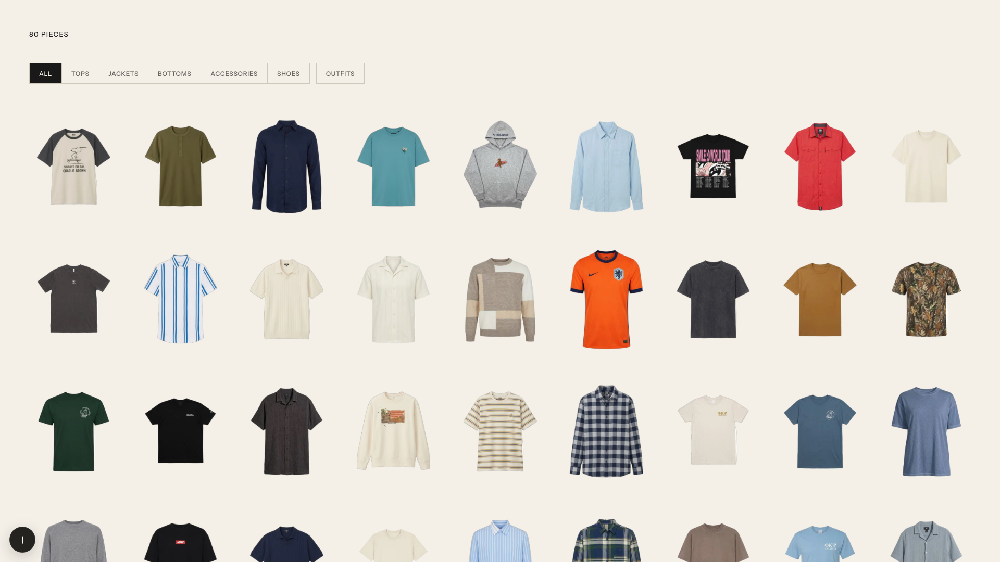
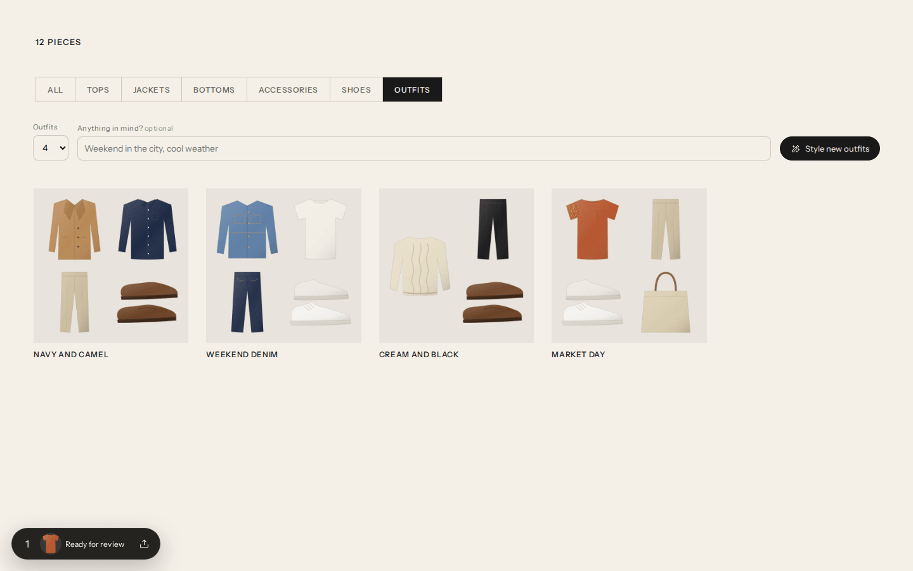
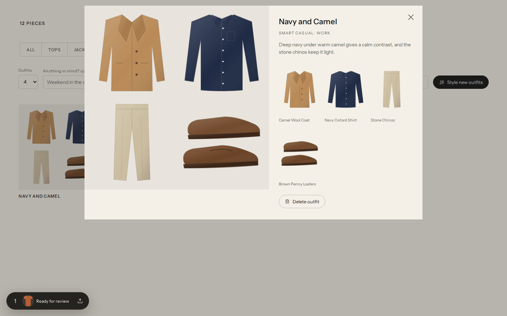
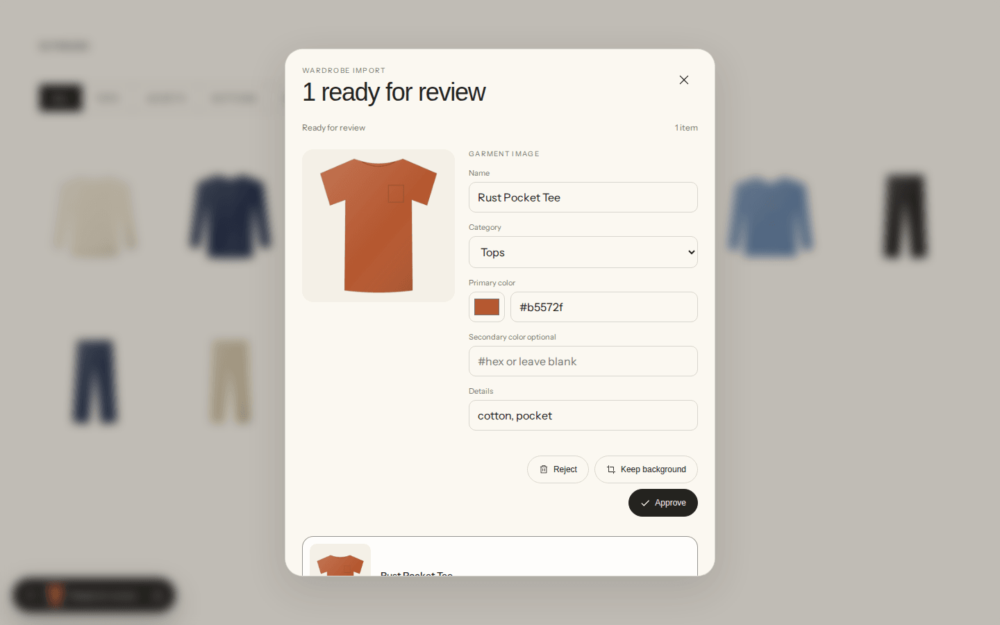
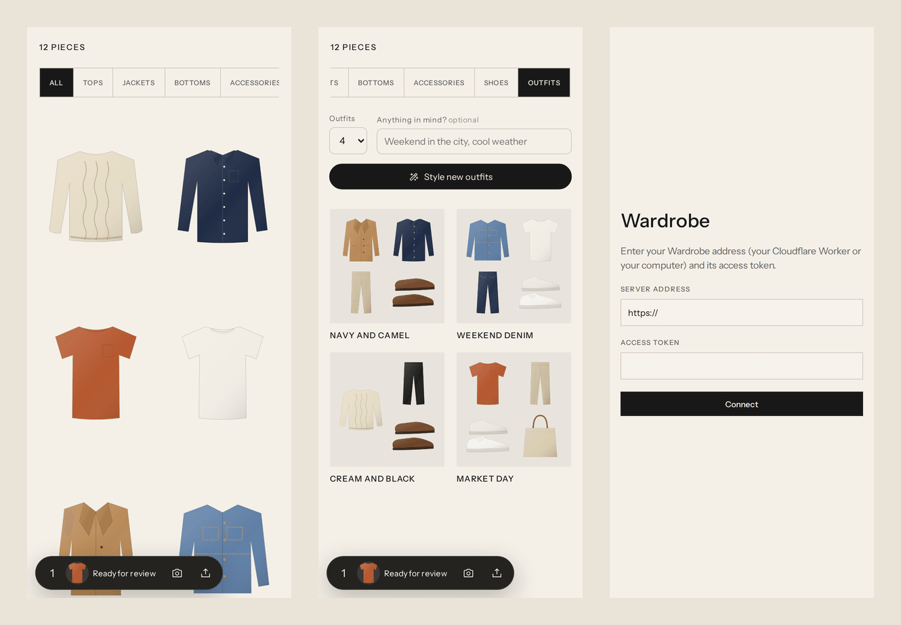

<div align="center">

# Wardrobe

Your closet on the web and on your iPhone. Snap a photo, and Claude finds each piece, cuts it out, and styles outfits from what you own.

[](LICENSE)
[](package.json)
[](https://www.anthropic.com/claude)

Based on [tandpfun/wardrobe](https://github.com/tandpfun/wardrobe) ([original post](https://x.com/cdngdev/status/2076812846793650485)).

</div>



<sub>A real closet from the original project. The other screenshots below use a small drawn sample closet.</sub>

## What it does

- **Add clothes from a photo.** Drop, paste, choose or take a picture of one piece or a whole outfit. Claude finds every garment and suggests a name, category, colors and tags.
- **Clean cutouts.** Each piece is cut out of the real photo with background removal, so it looks like your actual item. You check the crop and the cutout before anything is saved.
- **Style outfits.** Press **Style new outfits** and Claude builds looks from your closet, names them, and says why they work. Add a note like "cool weekend in the city" to steer it.
- **Edit and sort.** Filter by tops, jackets, bottoms, accessories and shoes. Change names, colors and tags at any time.
- **Works everywhere.** Run it on your computer, or on Cloudflare so the web app, phone browsers and the iPhone app share one closet.

## Screenshots

| Your closet | Edit a piece |
| --- | --- |
|  |  |

| Outfits styled by Claude | One outfit |
| --- | --- |
|  |  |

**Review before saving.** After Claude finds a piece and the background is removed, you check the details, then approve, reject, or keep the background.



**On the phone.** The closet, the outfits, and the iPhone app's first screen.



## Quick start (on your computer)

You need Node 22 or newer and an Anthropic API key from [console.anthropic.com](https://console.anthropic.com/settings/keys).

```bash
git clone https://github.com/njarrar/wardrobe-web-ios.git
cd wardrobe-web-ios
npm install
cp .env.example .env     # then put your key in ANTHROPIC_API_KEY
npm run dev              # http://localhost:5173
```

To run the built app instead:

```bash
npm run build
npm start                # http://localhost:4173
```

On your computer, garments are cut out by a small open model ([BiRefNet lite](https://huggingface.co/onnx-community/BiRefNet_lite)) through `@huggingface/transformers`. `npm install` adds it when it can, and the model downloads (about 200 MB) the first time you import. If it is missing, the app lets you keep the crop with its background.

### Use it from your phone on the same Wi-Fi

The server only listens on your computer by default. To open it from your phone, set both of these in `.env` and restart:

```bash
WARDROBE_HOST=0.0.0.0
WARDROBE_TOKEN=pick-a-long-random-string
```

The server refuses to listen on your network without a token. The browser and the app ask for it once and remember it.

## Run it on Cloudflare

Put your closet online so it is the same on every device. Photos and cutouts go in R2, your closet and outfits go in D1, and cutouts run from a Queue.

You need:

- A Cloudflare account on the **Workers Paid** plan ($5 a month). Queues need it, and framing each garment image takes more CPU time than the free plan allows.
- Cloudflare Images turned on (Images, then Transformations, in the dashboard). It removes backgrounds; 5,000 cutouts a month are free.
- An Anthropic API key.

One-time setup:

```bash
npx wrangler login
npx wrangler r2 bucket create wardrobe
npx wrangler d1 create wardrobe        # copy the database_id it prints into wrangler.jsonc
npx wrangler queues create wardrobe-jobs
npm run cf:migrate                     # creates the tables
npx wrangler secret put ANTHROPIC_API_KEY
npx wrangler secret put WARDROBE_TOKEN # pick a long random string
npm run cf:deploy
```

Open the `workers.dev` address it prints and enter your token. To copy a closet you built on your computer:

```bash
WARDROBE_TOKEN=your-token npm run cf:upload -- https://wardrobe.your-name.workers.dev
```

Run `npm run cf:deploy` again after each update. To try the Worker on your computer first, put `WARDROBE_TOKEN` and `ANTHROPIC_API_KEY` in `.dev.vars`, run `npx wrangler d1 migrations apply wardrobe --local`, then `npm run cf:dev`. Local Cloudflare Images can resize but not remove backgrounds, so cutouts keep their background there.

## iPhone app

The `ios/` folder holds a Capacitor app that shows the same closet. Point it at your Cloudflare Worker (easiest, works anywhere) or at the server on your computer (set `WARDROBE_HOST` and `WARDROBE_TOKEN` first, see above).

You need a Mac with Xcode 16 or newer:

```bash
npm install
npm run ios        # builds the web app, copies it into ios/, opens Xcode
```

In Xcode, pick your team under Signing & Capabilities, choose your iPhone, and press Run. On first launch the app asks for your server address and token. You can browse, edit, delete, add photos from your library or camera, and style outfits.

On any phone, the add button offers **Take photo** next to **Choose images**. Photos are turned upright and shrunk to 2048 px before upload.

## Claude Code skills

Two skills in `.claude/skills` let [Claude Code](https://claude.com/claude-code) work on your closet without an API key, because Claude Code looks at your photos itself:

```text
/import-clothes Import the clothes from ~/Pictures/outfits and add them to this wardrobe.
/style-outfits Put together six outfits for autumn.
```

The import skill finds each garment, cuts it out, checks every cutout, then writes to `data/library.json` and `data/imported/`. The outfit skill looks at your pieces and adds looks to `data/outfits.json`.

## How it works

| Part | Where |
| --- | --- |
| Web app (React 19 + Vite) | `src/` |
| Local server and API | `scripts/import-job-api.mjs`, `scripts/serve.mjs` |
| Cloudflare Worker (R2, D1, Queue, Images) | `worker/`, `wrangler.jsonc` |
| Claude calls (finding clothes, styling outfits) | `shared/claude.mjs` |
| iPhone app (Capacitor) | `ios/` |
| Claude Code skills | `.claude/skills/` |

Claude calls use `claude-opus-5` with structured JSON output. If Claude declines to read a photo, the API retries on the model Anthropic recommends (`fallbacks: "default"`).

Your photos and closet stay in `data/` on your computer (or in your own R2 and D1 on Cloudflare). `data/` is never committed.

## Settings

| Variable | Default |
| --- | --- |
| `ANTHROPIC_API_KEY` | Required |
| `WARDROBE_CLAUDE_MODEL` | `claude-opus-5` |
| `WARDROBE_CUTOUT_MODEL` | `onnx-community/BiRefNet_lite` (computer only) |
| `WARDROBE_DATA_DIR` | `data` |
| `WARDROBE_HOST` | `127.0.0.1` |
| `WARDROBE_TOKEN` | Required when `WARDROBE_HOST` is not local, and on Cloudflare |
| `PORT` | `4173` (for `npm start`) |

## Tests

```bash
npm test           # API and image tests, with a stand-in for the Claude API
npm run check      # build, then test
```

## License

[MIT](LICENSE)
